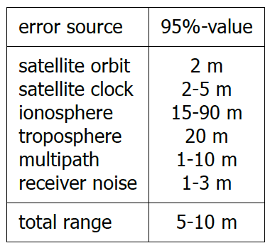

## **14 Positioning**

### **14.1 Geometric interpretation**

The GPS pseudorange measurement relates to the geometric range(distance) from satellite to receiver but is also caused by the **receiver clock offset**. The receiver clock offset is the **same** for all pseudoranges measured by the receiver at a specific time.

In two dimensions, we would need to solve for **two receiver position coordinates** and **one receiver clock error**, hence in total **three unknown parameters**, so we need at least three pseudorange measurements:  

The measured pseudoranges must be reduced or enlarged with exactly the same amount to **meet at one physical position**. The amount to make that happen is the **receiver clock offset**.

### **14.2 Pseudorange observation equation**

* 𝑏𝑟: is **positive** if the receiver clock is ahead of GPS system time, and the measured pseudoranges are **‘too long’**.  
* ers: unavoidable random measurement error

### **14.3 Positioning: parameter estimation**

GPS positioning employs the principle of least squares estimation. Since the GPS observation model is **nonlinear**, this involves a **linearisation** for the unknown parameters, around an approximate position. The linearized model of observation equations reads:  

Next, a **leastsquares algorithm** is used to solve this linearized model, presented in matrix-vector form, where a **Best Linear Unbiased Estimation** solution can be obtained.

**NMEA** is a well-known and widely used format for storing and exchanging GPS (GNSS) Position, Velocity and Time (PVT) solutions.

### **14.4. Reference systems**

By default, **GPS positioning** yields Cartesian coordinates (𝑥, 𝑦, 𝑧) in **WGS84**.

In **differential mode**, the position coordinates:

* Are generally provided in **a local or regional reference system**(e.g. ETRS89 in Europe).  
* For the user receiver is in the same reference system as the position coordinates of the base, or reference station.

### **14.5 GPS accuracy and error sources**

The quality of the GPS position solution is largely dependent on: 

* The number of **available satellites** (enough satellites are visible)  
* Their **geometry** with respect to the user (On all sides of the receiver at high and low elevation angles)

No satellites are visible **beneath** the receiver (below the local horizon): vertical position accuracy is generally poorer than horizontal accuracy by about **a factor of 1.5**.

The accuracy of standalone positioning with GPS is in the order of **5-15 meters** under reasonable satellite visibility.

The GPS pseudorange measurements contain **errors** due to:

* Inaccurate satellite orbit and clock information,   
* delays along the path of the radio signal:   
  * **atmospheric delays** (ionosphere and troposphere),  
  * **local effects** including multipath,   
  * and **measurement noise**

 

Local effects:

* **Shadowing:** one or more satellite signals are blocked by surrounding obstacles.   
* **Signal reflections:** signals arrive at the receiver after bouncing off an object.  
* **Multipath:**  both the direct and reflected signals arrive at the receiver

### **14.6. Standalone positioning: example**

*Nothing interesting.*
