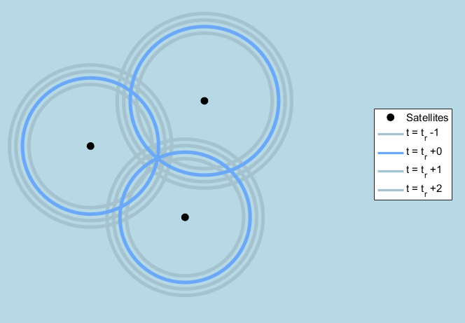
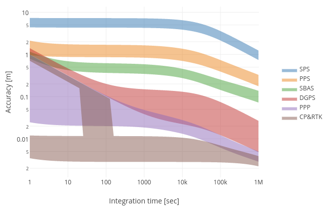

## 15 - GPS positioning modes

### 15.1 - Relative positioning, or DGPS

DGPS uses a data link to a **nearby base** or **reference station** (GPS receiver at an accurately known position). The errors affect both receivers **almost identically** if the distance between them is small enough (5-10km).

* ​​From the differenced observations, the **baseline** (vector) between the two receivers can be computed through least-squares estimation.
* The position of the rover is then obtained by adding the baseline vector to the accurately known coordinates of the reference station.

#### 15.1.1 - RTK

More detailed information in the PPP-RTK Market and Technology Report, 2 \- Technical Analysis

### 15.1.2 - RTK — carrier phase observation equation

The carrier phase observation equation:

{width=90%}

with

* $b_{1,2} = b_2 - b_1$: the receiver clock offset
* $N_{1,2}^s = N_2^s - N_1^s$: the carrier phase cycle ambiguity
* $\underline{e}_{1,2}^s = \underline{e}_2^s - \underline{e}_1^s$: the other error sources, like atmospheric delays and satellite-related errors

### 15.1.3 - RTK — carrier phase positioning: parameter estimation

We use relative positioning and develop the model of observation equations for a short baseline. The two receivers being close together implies that the delays will be very similar, and in the sequel, we assume them to be really equal: **$ds_1 = ds_2$**. With the position coordinates of the reference or base station $(x_1, y_1, z_1)$ being known, and taking the difference of measurements across the two receivers, $\varphi^s_{1,2} = \varphi^s_2 − \varphi^s_1$, we obtain:

{width=60%}

$$\varphi_r^s = \lambda \frac{\Phi_r^s}{2\pi}$$

The goal of RTK positioning is to estimate the position coordinates of the rover receiver $(x_2, y_2, z_2)$, and this is done while keeping the reference station fixed to the given position coordinates.

In the above model, the receiver clock offset parameter $b_{1,2}$ appears equally in all equations and can be removed by **taking differences between measurements**.

{width=80%}

An adequate solution is provided by the LAMBDA method to slove multiple ambiguity parameters *N* present in the problem at the same time.

### 15.1.6 - PPP

More detailed information in the PPP-RTK Market and Technology Report, 2 \- Technical Analysis

### 15.2 - Current developments

**PPP-RTK:** More detailed information in the PPP-RTK Market and Technology Report  
Bring high-accuracy positioning techniques, e.g. **RTK and PPP, to low-cost devices**:

1. The smartphone retrieves DGPS corrections of a nearby reference station through NTRIP, and forwards these to the GPS receiver connected to the smartphone.
2. The GPS receiver chip combines the corrections with the measurements of the rover receiver and delivers a centimetre-accurate RTK position solution, which it relays back to the app on the smartphone.
3. This allows for centimetre-accurate navigation, in real-time, with smartphones.

**Satellite Based Augmentation Systems (SBAS)**  
E.g. the European EGNOS system. SBAS is a pseudorange code Differential GPS approach for large geographical areas(wide areas).

* Design to enable GPS-based aircraft **precision approaches**.
* Rely on the same principles as PPP.  
* Focus on **integrity** rather than accuracy (integrity refers to the trust that can be placed in the resulting position solution, the solution is largely fault tolerant)  
* The corrections are transmitted on the same radio frequency as GPS signals, so no additional data link is necessary.

### 15.3 - Processing strategies, dynamic model and observation period

{width=80%}

**Measurement Time and Accuracy**:

* **Static Solution:** Longer measurement durations improve accuracy for stationary receivers by averaging observations. Position accuracy is shown as a function of the measurement duration in the figure above.  
* **Kinematic Solution:** For moving receivers, dynamic models (e.g., constant velocity) help improve accuracy.

**Realtime vs. Postprocessing**:

* **Realtime:** Suitable for immediate results, slightly lower accuracy.  
* **Postprocessing:** Higher accuracy but results are delayed.

**Measurement Rate**:

* **Higher Rates:** Improve precision slightly for dynamic scenarios but offer limited additional accuracy due to correlated errors.  
* **Lower Rates:** Sufficient for slow-moving applications like tectonic monitoring.
