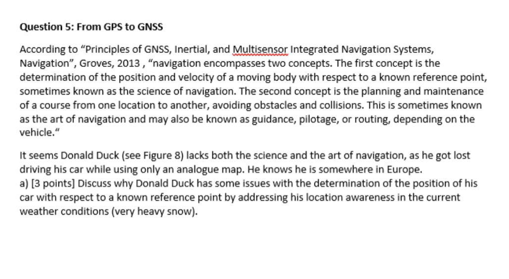

## Lecture 1: Introduction

### 1. Course Overview and Context

#### 1.1 Main Focus Areas
- **Global Navigation Satellite Systems (GNSS)**
  - Modern positioning technologies
  - Satellite-based navigation systems
  - Integration with other technologies

- **Indoor Positioning Technologies**
  - Technologies for indoor environment
  - Specific challenges and solutions
  - Integration with outdoor positioning

- **Location-aware Applications**
  - Focus on built environment
  - People and device tracking
  - Asset management

#### 1.2 Core Components
- Reference Systems
  - Global systems
  - Local systems (e.g., Dutch reference system)
  - Linear reference systems

- Technical Foundations
  - Coordinate systems
  - Map projections
  - Positioning methods and techniques

- Contextual Factors
  - Social aspects
  - Technical developments
  - Legislative requirements

### 2. Study Goals in Detail

#### 2.1 Fundamental Understanding
- **Location Awareness**
  - Definition and concepts
  - Application in real-world scenarios
  - Importance in modern applications

- **Location Sensitivity**
  - Geographic relevance
  - Area of attention vs. area of influence
  - Context-dependent behavior

- **Context Awareness**
  - Environmental factors
  - User situation
  - Application requirements

#### 2.2 Technical Competencies
- **Reference Systems**
  - Global coordinate systems
  - Local coordinate systems
  - Transformations between systems

- **Positioning Technologies**
  - GNSS principles
  - Indoor positioning methods
  - Hybrid solutions

#### 2.3 Evaluation Skills
- **Technical Performance Assessment**
  - Availability
  - Accuracy
  - Integrity
  - Continuity

- **Ethical Considerations**
  - Privacy issues
  - Data protection
  - Social implications

### 3. Location-Based Services (LBS)

#### 3.1 Key Characteristics
- **Performance Metrics**
  - Sub-second query response
  - High scalability
  - 99.9999% reliability
  - Real-time capabilities

- **System Requirements**
  - Mobile accessibility
  - Device compatibility
  - Security features

#### 3.2 Use Cases
- **Proximity Services**
  - Finding nearby resources
  - Location-based alerts
  - Context-aware information

- **Geofencing**
  - Boundary definition
  - Entry/exit monitoring
  - Safety applications

- **Routing**
  - Path optimization
  - Navigation assistance
  - Real-time updates

- **Tracking**
  - Asset monitoring
  - People tracking
  - Fleet management

### 4. Technical Infrastructure

#### 4.1 Mobile Components
- **Communication Systems**
  - Cellular networks
  - Wi-Fi
  - Bluetooth

- **Positioning Hardware**
  - GPS receivers
  - Inertial sensors
  - Integrated systems

#### 4.2 Accuracy Requirements
| Range | Applications |
|-------|-------------|
| Global | Stock market, News |
| Regional (<80km) | Weather forecasting |
| Local (<20km) | Traffic information |
| 1-20km | Emergency alerts |
| 100m-1km | Points of Interest |
| 10-100m | Outdoor navigation |
| 1-10m | Object identification |
| 0.01-1m | Surveying |

### 5. Current Trends and Future Developments

#### 5.1 Emerging Technologies
- Ultra-wideband (UWB)
- 5G positioning
- Integrated sensor systems

#### 5.2 Application Trends
- Smart cities
- Autonomous navigation
- Augmented reality integration

### 6. Practical Implications

#### 6.1 Privacy Considerations
- Data collection
- User consent
- Regulatory compliance

#### 6.2 Implementation Challenges
- Technical limitations
- Environmental factors
- Integration issues

### References
- Groves, 2013 - Principles of GNSS, Inertial, and Multisensor Integrated Navigation Systems
- Additional course materials and research papers

### Answer of the question

  *Donald Duck faces multiple positioning challenges while navigating with an analog map in snowy weather conditions: First, reduced visibility due to snow makes it difficult to identify traditional visual reference points such as road signs and buildings, preventing him from correlating map locations with the actual environment. Second, snow coverage obscures road boundaries and landmarks, further complicating the determination of relative position. Finally, relying solely on an analog map lacks real-time positioning capabilities, unlike modern GNSS systems that provide accurate location information and navigation parameters. These combined factors make it challenging for him to accurately determine his position relative to known reference points.*